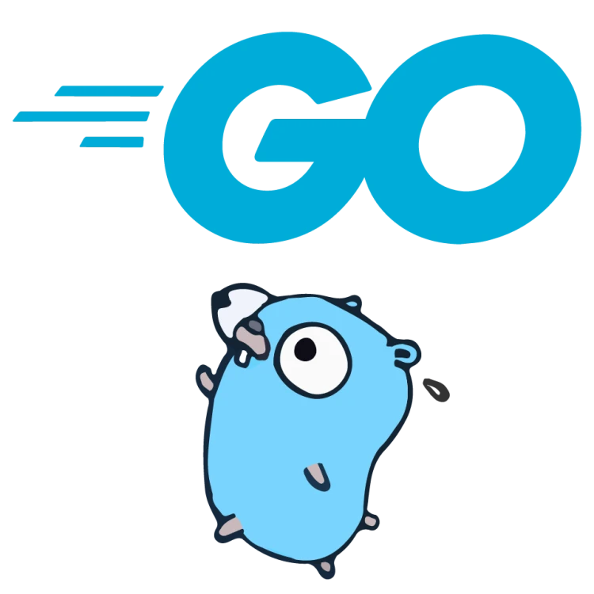

<p align="center">
  
</p>

<h1 align="center">go-api-scaffolding</h1>

<p align="center">
  A production Go API foundation you own outright: net/http and chi, pgx with sqlc,
  an OpenAPI contract, OpenTelemetry, and a generator that keeps the codebase growing.
</p>

<p align="center">
  <a href="https://github.com/y0f/go-api-scaffolding/actions/workflows/ci.yml"></a>
  <a href="https://goreportcard.com/report/github.com/y0f/go-api-scaffolding"></a>
  <a href="https://pkg.go.dev/github.com/y0f/go-api-scaffolding"></a>
  
  <a href="LICENSE"></a>
</p>

---

A complete Go service with the production concerns already wired in, and a generator
that adds new resources in the same shape, so the scaffold keeps working on day 200,
not just day 1. Clone it, rename the module, and there is nothing to import at runtime
and nothing to lock into.

## What is wired in

**HTTP**
- Standard `net/http` handlers routed by chi, with no framework context.
- `api/openapi.yaml` is the source of truth. Request validation and the typed
  server interface are generated from it; CI fails if they drift.
- RFC 9457 `application/problem+json` errors, each carrying the active trace ID.
- Readiness-first graceful drain: `/readyz` flips to 503, then in-flight requests
  bleed off, then the pool closes.

**Data**
- pgx/v5 with a tuned pool and a transaction helper.
- sqlc generates type-safe queries from plain SQL checked against the real schema.
- goose migrations, embedded into the binary and run as an explicit deploy step.
- A transactional outbox writes events in the same transaction as the state change.
- Idempotency keys make unsafe requests safe to retry.

**Auth**
- Bearer tokens verified against JWKS (OIDC) or a configured RSA public key.
- Role-based access checks in the service layer, with a single seam for OPA or Casbin.
- In development an ephemeral key is generated and a usable token is logged at startup.

**Observability**
- OpenTelemetry traces over OTLP and Prometheus metrics at `/metrics` (unauthenticated by convention; restrict it at the network layer in production).
- slog with `trace_id` and `span_id` on every line, and a handler that redacts
  secrets like passwords and tokens before they are logged.
- `/livez` and `/readyz` probes, plus pprof and expvar on a separate guarded port.

**Testing**
- Integration tests run against a real Postgres via testcontainers, isolated per
  test by cloning a migrated template database so they are safe to run in parallel.
- Unit tests cover business logic with no database.

**Supply chain**
- GitHub Actions pinned to commit SHAs, kept current by Dependabot.
- `govulncheck` and CodeQL gate the build; an OpenAPI and sqlc drift gate keeps
  generated code honest.
- A multi-stage build produces a distroless, non-root, static image.
- GoReleaser publishes signed binaries (cosign keyless) with an SBOM.

## Quickstart

```bash
git clone https://github.com/y0f/go-api-scaffolding
cd go-api-scaffolding

task up        # builds and starts Postgres, runs migrations, starts the API
```

The API listens on `:8080`. In development it prints a bearer token at startup;
copy it from the logs:

```bash
export TOKEN="<token from the api startup log>"

# List widgets (public)
curl -s localhost:8080/v1/widgets

# Create one (requires the token)
curl -s -X POST localhost:8080/v1/widgets \
  -H "Authorization: Bearer $TOKEN" \
  -H "Content-Type: application/json" \
  -H "Idempotency-Key: $(uuidgen)" \
  -d '{"name":"first"}'
```

Prefer running the binary directly? Install the toolchain and point it at any
Postgres:

```bash
task setup
task migrate
task run
```

See [`.env.example`](.env.example) for every setting.

## Add a resource

The generator stamps a new vertical slice (SQL, store, service, handler, test, and
a migration) in the same shape as the example `widget` module:

```bash
go run ./cmd/forge add resource Order
```

It prints the next steps: register the queries file with sqlc, run `task generate`,
mount the handler, and apply the migration with `task migrate`. The example slice in
`internal/modules/widget` shows the full spec-first pattern with auth and idempotency.

## Common tasks

```bash
task generate          # regenerate sqlc and OpenAPI code
task lint              # golangci-lint v2
task test              # unit tests with the race detector and coverage
task test:integration  # integration tests against real Postgres (needs Docker)
task vuln              # govulncheck
task observe           # full stack with OpenTelemetry Collector, Tempo, Prometheus, Grafana
task build             # build api, migrate, and forge into ./bin
```

With `task observe` running, Grafana is on `http://localhost:3000` with Prometheus
and Tempo already provisioned, and traces flow from the API through the Collector
into Tempo.

## Layout

```
cmd/api        service entrypoint and composition root
cmd/migrate    migration runner
cmd/forge      resource generator
internal/      config, server, auth, observability, platform, modules
api/           the OpenAPI contract
migrations/    versioned SQL, embedded into the binaries
deployments/   Dockerfile, docker compose, observability configs
docs/          architecture notes and ADRs
```

The architecture, request flow, and the reasoning behind each choice are in
[`docs/architecture.md`](docs/architecture.md) and [`docs/adr`](docs/adr).

## For AI agents

An [`AGENTS.md`](AGENTS.md) describes the build and conventions for coding agents.
Because `api/openapi.yaml` is the single source of truth, the operations convert
cleanly into tool or function schemas for an LLM without hand-written glue.

## Rename the module

The module path is `github.com/y0f/go-api-scaffolding`. To make it yours:

```bash
grep -rl github.com/y0f/go-api-scaffolding . \
  | xargs sed -i 's#github.com/y0f/go-api-scaffolding#github.com/you/yourapp#g'
go mod edit -module github.com/you/yourapp
go mod tidy
```

The `FORGE_` environment prefix and the `forge` generator name are independent of
the module path; rename them too if you like.

## Verify a release

Released binaries are signed with cosign keyless signing. Verify the checksums:

```bash
cosign verify-blob \
  --bundle checksums.txt.bundle \
  --certificate-identity-regexp 'https://github.com/y0f/go-api-scaffolding' \
  --certificate-oidc-issuer https://token.actions.githubusercontent.com \
  checksums.txt
```

## License

MIT. See [LICENSE](LICENSE).
