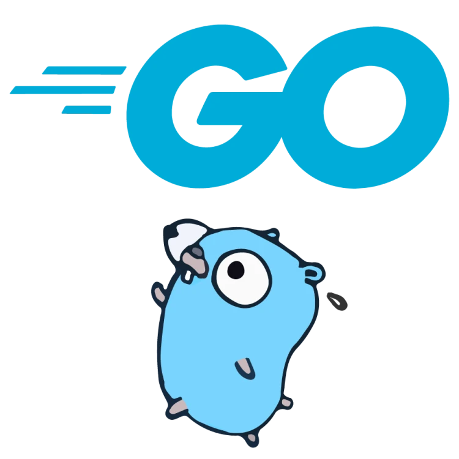

<!-- forge:begin init -->
<p align="center">
  
</p>
<!-- forge:end init -->

<h1 align="center">go-api-scaffolding</h1>

<!-- forge:begin init -->
<p align="center">
  A Go API service to clone, rename and build on. The production concerns are
  wired and tested; none of it is a framework.
</p>
<!-- forge:end init -->

<p align="center">
  <a href="https://github.com/y0f/go-api-scaffolding/actions/workflows/ci.yml"></a>
  <a href="https://pkg.go.dev/github.com/y0f/go-api-scaffolding"></a>
  
  <a href="LICENSE"></a>
</p>

## What you get

| | |
|---|---|
| HTTP | `net/http` and chi. Requests are validated against `api/openapi.yaml`, the typed server interface is generated from it, and CI fails on drift. Errors are RFC 9457 `problem+json` with the trace ID. Readiness-first graceful drain. |
| Data | pgx/v5, sqlc-generated queries checked against the real schema, goose migrations embedded in the binary and run as a deploy step. |
| Auth | Bearer tokens verified against JWKS (OIDC) or an RSA key. RBAC in the service layer. In development a token is minted and logged at startup. |
| Observability | Prometheus `/metrics`, slog with `trace_id` and `span_id` on every line and secret redaction. |
<!-- forge:begin otlp -->
| Tracing | OpenTelemetry spans exported over OTLP, with a Collector, Tempo, Prometheus and Grafana compose profile. |
<!-- forge:end otlp -->
<!-- forge:begin outbox -->
| Outbox | Events written in the same transaction as the state change, relayed at-least-once by a poller. |
<!-- forge:end outbox -->
<!-- forge:begin idempotency -->
| Idempotency | `Idempotency-Key` on unsafe requests: the response is stored with the write and replayed on retry, scoped to the caller. |
<!-- forge:end idempotency -->
<!-- forge:begin admin -->
| Admin | pprof and expvar on a separate token-gated port. |
<!-- forge:end admin -->
| Testing | Unit tests without a database. Integration tests on a real Postgres via testcontainers, each test on its own clone of a migrated template database. |
| Supply chain | SHA-pinned Actions, govulncheck and CodeQL, distroless non-root image, cosign-signed releases with an SBOM. |
| Growth | `forge add resource <Name>` stamps a new vertical slice. |

<!-- forge:begin init -->
## Start a project

```bash
go run ./cmd/forge init
```

It asks for your module path and which optional slices to keep: the example
resource, outbox, idempotency keys, OTLP export with the Grafana stack, and
the admin listener. Everything you do not keep is deleted, the installer
removes itself, and the result is regenerated and built. Non-interactive:

```bash
go run ./cmd/forge init -yes -module github.com/you/app -drop outbox,admin
```

The `FORGE_` environment prefix and the `forge` command name stay; both are
independent of the module path. The rest of this file describes the scaffold
with everything kept.
<!-- forge:end init -->

## Quickstart

Needs Docker and [Task](https://taskfile.dev).

```bash
git clone https://github.com/y0f/go-api-scaffolding
cd go-api-scaffolding
task up          # Postgres, migrations, API on :8080
```

The API log prints a development bearer token at startup.
<!-- forge:begin example -->

```bash
export TOKEN="<token from the api log>"

curl -s localhost:8080/v1/widgets

curl -s -X POST localhost:8080/v1/widgets \
  -H "Authorization: Bearer $TOKEN" \
  -H "Content-Type: application/json" \
<!-- forge:begin idempotency -->
  -H "Idempotency-Key: $(uuidgen)" \
<!-- forge:end idempotency -->
  -d '{"name":"first"}'
```
<!-- forge:end example -->

`task down` stops the stack and deletes the database volume.

To run the binary outside Docker against any Postgres, copy `.env.example` to
`.env` (Task loads it), then:

```bash
task setup       # build the pinned toolchain from tools/go.mod into ./bin
task migrate
task run
```

## Add a resource

```bash
go run ./cmd/forge add resource Order
```

This writes `internal/modules/order` (domain, store, service, handler, test,
queries) and a migration, registers the queries with sqlc, and prints the
remaining steps: `task generate`, add the handler to `RouterDeps.Mounts`, grant
the write permission, `task migrate`.

Generated modules are plain chi handlers with authentication, authorization,
validation and `problem+json` errors. Make one spec-first by adding its paths
to `api/openapi.yaml` and implementing the generated interface.
<!-- forge:begin example -->
The `widget` module is that spec-first form of the same slice.
<!-- forge:end example -->

## Tasks

```bash
task generate          # regenerate sqlc and OpenAPI code
task lint              # golangci-lint
task test              # unit tests with coverage
task test:race         # unit tests under the race detector (needs a C toolchain)
task test:integration  # integration tests on real Postgres (needs Docker)
task vuln              # govulncheck
task ci                # every gate CI runs
<!-- forge:begin otlp -->
task observe           # full stack with OpenTelemetry Collector, Tempo, Prometheus, Grafana
<!-- forge:end otlp -->
task build             # api, migrate and forge into ./bin
```
<!-- forge:begin otlp -->

With `task observe`, Grafana is at `http://localhost:3000` with Prometheus and
Tempo provisioned; traces flow from the API through the Collector into Tempo.
<!-- forge:end otlp -->

The toolchain (linter, generators, scanner, live reload) is pinned in
`tools/go.mod`, a module of its own so none of it enters the application's
dependency graph. CI builds the same versions from the same file.

## Layout

```
cmd/api          composition root
cmd/migrate      migration runner
cmd/forge        resource generator and its templates
api/             the OpenAPI contract
internal/
  config/        typed, validated environment configuration
  server/        http.Server, middleware, router, health, admin
  auth/          token verification, RBAC, OpenAPI authenticator
  observability/ slog handlers, OpenTelemetry, Prometheus
  platform/      pgx pool and tx helper, problem+json
<!-- forge:begin idempotency -->
  idempotency/   store and replay for unsafe requests
<!-- forge:end idempotency -->
<!-- forge:begin outbox -->
  outbox/        transactional outbox and relay
<!-- forge:end outbox -->
<!-- forge:begin workers -->
  maintenance/   periodic reaper
<!-- forge:end workers -->
  modules/       one package per resource
  gen/           generated code, committed
  testutil/      Postgres testcontainer for integration tests
migrations/      versioned SQL, embedded into the binaries
deployments/     Dockerfile and docker compose
docs/            architecture and ADRs
```

Design and reasoning: [`docs/architecture.md`](docs/architecture.md) and
[`docs/adr`](docs/adr). Conventions for coding agents: [`AGENTS.md`](AGENTS.md).

## Verify a release

```bash
cosign verify-blob \
  --bundle checksums.txt.bundle \
  --certificate-identity-regexp 'https://github.com/y0f/go-api-scaffolding' \
  --certificate-oidc-issuer https://token.actions.githubusercontent.com \
  checksums.txt
```

## License

MIT. See [LICENSE](LICENSE).
