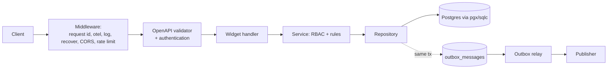

# Architecture

## Layout

```
cmd/
  api/        composition root: load config, wire dependencies, serve
  migrate/    apply migrations as an explicit deploy step
  forge/      day-2 generator: forge add resource <Name>
internal/
  config/         typed, validated environment configuration
  observability/  slog (trace correlation + redaction), OpenTelemetry, Prometheus
  platform/
    database/   pgx pool and transaction helper
    problem/    RFC 9457 problem+json responses
  server/         http.Server, middleware, router, health, graceful drain, admin
  auth/           JWKS/RSA verification, RBAC, OpenAPI authenticator
  idempotency/    store and replay for unsafe requests
  outbox/         transactional outbox and relay
  modules/
    widget/     example vertical slice (sql, store, service, handler)
  gen/            generated code (sqlc + oapi-codegen), committed
api/openapi.yaml  the API contract, source of truth
migrations/       versioned SQL, embedded into the binaries
deployments/      Dockerfile, docker compose, observability configs
```

## Request flow



A request passes global middleware, then the OpenAPI validator checks it against
`api/openapi.yaml` and runs the bearer authentication function for protected
operations. The handler maps transport types to the service, which enforces
authorization before calling the repository. Writes that emit events persist the
event to `outbox_messages` in the same transaction; a relay publishes them
at-least-once.

## Boundaries

- The router, logger, and repository sit behind interfaces, so they can be
  swapped without touching business logic.
- `internal/gen` is generated and never edited by hand. CI fails if it drifts
  from `migrations/`, the query files, or `api/openapi.yaml`.
- Each resource is one package (a vertical slice), which keeps blast radius small
  and lets the generator add a feature by writing one directory.

## Observability

Every log line carries `trace_id` and `span_id` from the active span, so any log
backend can link a line to its trace in Tempo. Metrics are exposed at `/metrics`
for Prometheus. Tracing is enabled by setting `FORGE_OTEL_OTLP_ENDPOINT`.

`/metrics`, `/livez`, and `/readyz` are unauthenticated on the public listener,
which is the usual Prometheus and Kubernetes-probe convention; restrict them at
the network layer in production. pprof and expvar are kept off the public
listener entirely, on a separate token-gated admin server.
