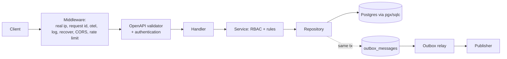

# Architecture

## Layout

```
cmd/
  api/        composition root: load config, wire dependencies, serve
  migrate/    apply migrations as an explicit deploy step
  forge/      day-2 generator: go run ./cmd/forge add resource <Name>
internal/
  config/         typed, validated environment configuration
  observability/  slog (trace correlation + redaction), OpenTelemetry, Prometheus
  platform/
    database/   pgx pool and transaction helper
    problem/    RFC 9457 problem+json responses
  server/         http.Server, middleware, router, health, graceful drain, admin
  auth/           JWKS/RSA verification, RBAC, OpenAPI authenticator
  idempotency/    store and replay for unsafe requests
  outbox/         transactional outbox and relay
  maintenance/    periodic reaper for expired keys and published events
  modules/
    widget/     example vertical slice (sql, store, service, handler)
  gen/            generated code (sqlc + oapi-codegen), committed
  testutil/       Postgres testcontainer with per-test template cloning
api/openapi.yaml  the API contract, source of truth
migrations/       versioned SQL, embedded into the binaries
deployments/      Dockerfile, docker compose, observability configs
```

Not every project keeps every package: `forge init` removes the slices you do
not select.

## Request flow


```mermaid
flowchart LR
    client[Client] --> mw[Middleware:
    real ip, request id, otel, log, recover, CORS, rate limit]
    mw --> val[OpenAPI validator
    + authentication]
    val --> h[Handler]
    h --> svc[Service: RBAC + rules]
    svc --> repo[Repository]
    repo --> pg[(Postgres via pgx/sqlc)]
    %% forge:begin outbox
    repo -. same tx .-> ob[(outbox_messages)]
    ob --> relay[Outbox relay] --> pub[Publisher]
    %% forge:end outbox
```

A request passes global middleware, then the OpenAPI validator checks it against
`api/openapi.yaml` and runs the bearer authentication function for protected
operations. The handler maps transport types to the service, which enforces
authorization before calling the repository.
<!-- forge:begin outbox -->
Writes that emit events persist the event to `outbox_messages` in the same
transaction; a relay publishes them at-least-once.
<!-- forge:end outbox -->

## Boundaries

- The repository sits behind an interface, so business logic is unit-tested
  with a fake. The router and logger are the standard `http.Handler` and
  `*slog.Logger` types; there is no seam that exists only to satisfy a pattern.
- `internal/gen` is generated and never edited by hand. CI fails if it drifts
  from `migrations/`, the query files, or `api/openapi.yaml`.
- Each resource is one package (a vertical slice), which keeps blast radius small
  and lets the generator add a feature by writing one directory.

## Observability

Every log line and problem response carries the trace ID of the active span, so
a log backend can link a line to its trace. Metrics are exposed at `/metrics`
for Prometheus.
<!-- forge:begin otlp -->
Spans are exported when `FORGE_OTEL_OTLP_ENDPOINT` is set; `task observe` runs
a Collector, Tempo, Prometheus and Grafana to receive them.
<!-- forge:end otlp -->

`/metrics`, `/livez`, and `/readyz` are unauthenticated on the public listener,
which is the usual Prometheus and Kubernetes-probe convention; restrict them at
the network layer in production.
<!-- forge:begin admin -->
pprof and expvar are kept off the public listener entirely, on a separate
token-gated admin server.
<!-- forge:end admin -->
